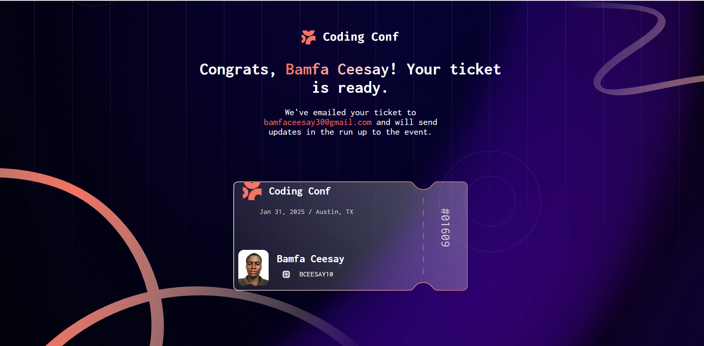

# Frontend Mentor - Conference ticket generator solution

This is a solution to the [Conference ticket generator challenge on Frontend Mentor](https://www.frontendmentor.io/challenges/conference-ticket-generator-oq5gFIU12w). Frontend Mentor challenges help you improve your coding skills by building realistic projects. 

## Table of contents

- [Overview](#overview)
  - [The challenge](#the-challenge)
  - [Screenshot](#screenshot)
  - [Links](#links)
- [My process](#my-process)
  - [Built with](#built-with)
  - [What I learned](#what-i-learned)
  - [Continued development](#continued-development)
- [Author](#author)

## Overview

### The challenge

Users should be able to:

- Complete the form with their details
- Receive form validation messages if:
  - Any field is missed
  - The email address is not formatted correctly
  - The avatar upload is too big or the wrong image format
- Complete the form only using their keyboard
- Have inputs, form field hints, and error messages announced on their screen reader
- See the generated conference ticket when they successfully submit the form
- View the optimal layout for the interface depending on their device's screen size
- See hover and focus states for all interactive elements on the page

### Screenshot




### Links

- Solution URL: https://github.com/BCEESAY10/ticket-generator-challenge/
- Live Site URL: https://bceesay10.github.io/ticket-generator-challenge/

## My process

### Built with

- Semantic HTML5 markup
- CSS custom properties
- Flexbox
- CSS Grid
- Font awesome
- JavaScript


### What I learned

I have learnt how to:
1. make the background image cover the entire container without distortion.
2. make the child elements (like .svg-image) centered within the grid container.

```css
}
.image-container{
    background: url(./assets/images/background-desktop.png) no-repeat center/cover;
    width: 100%;
    height: auto;
    position: relative;
    aspect-ratio: 16 / 9;
    overflow-y: hidden;
    display: grid;
    place-content: center;
}
.svg-image{
    position: absolute;
}

.svg-image:nth-child(1){
    width: 100%;
}

.svg-image:nth-child(1){
    width: 100%;
}

.svg-image:nth-child(2){
    top: 100px;
    right: 0;
}
.svg-image:nth-child(3){
    left: 0;
    bottom: 0;
}

.svg-image:nth-child(4){
    top: -100px;
    left: 100px;
}
.svg-image:nth-child(5){
    top: 50%;
    right: 350px;
}
```

In JavaScript, I learned how to use the *FileReader API* to display an uploaded image dynamically. The function reads the file as a *data URL*, sets it as the 'src' of an image ('uploadedImage'), and updates the UI by showing 'fileAction' and hiding 'messageAction'.

```js
function displayUploadedImage(file){
    const reader = new FileReader()

    reader.onload = e => {
        uploadedImage.src = e.target.result
        fileAction.classList.add('show')
        messageAction.classList.add('hide')
    }
    reader.readAsDataURL(file)
}
```

### Continued development
If the need be, I would love to enhance this project. If there is any adjustment you deem necessary, please feel free to consult me. I am open to continuous development.


## Author

- Website - [https://bamfa-portfolio.vercel.app]
- Frontend Mentor - [@BCEESAY10]
- LinkedIn - [https://www.linkedin.com/in/bamfa-ceesay-b581042b4/]

